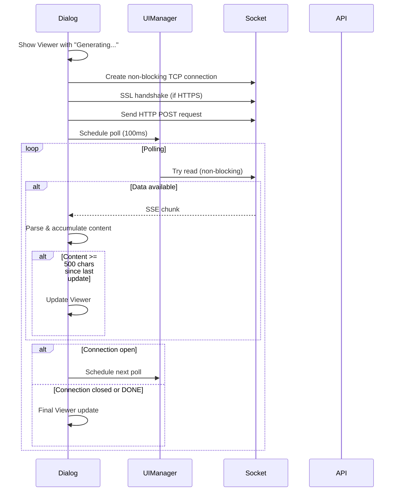
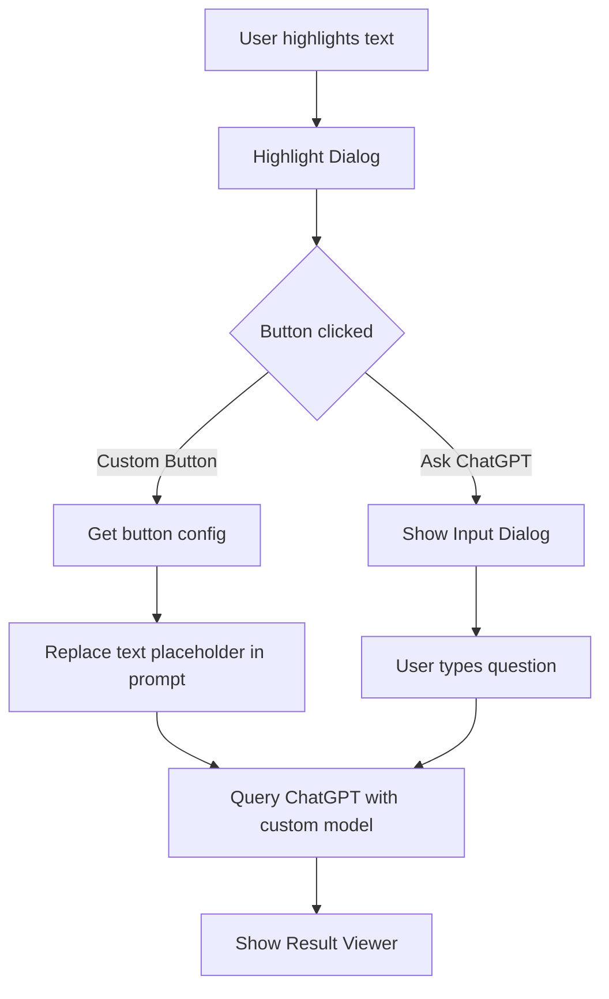

# Custom Highlight Buttons Implementation

**Date:** 2025-12-21

## Summary

Added support for user-defined custom buttons in the highlight dialog. Each button can have its own label, model, and prompt template configured in `configuration.lua`.

## Changes Made

### 1. `gpt_query.lua`
- Modified `queryChatGPT` function to accept an optional `options` parameter
- Added support for per-request model override via `options.model`
- Added `stripThinkingTags` helper function to remove `<think>...</think>` content
- Added support for `strip_thinking_tags` configuration option
- Added `queryChatGPTStream` function for streaming responses with SSE parsing
- Added `isStreamingEnabled` helper to check configuration
- Module now exports a table: `{ query, stream, isStreamingEnabled }`

### 2. `dialogs.lua`
- Added new `showCustomPromptResult(ui, highlightedText, buttonConfig)` function
- This function executes custom prompts directly without showing the question input dialog
- Replaces `{text}` placeholder with highlighted text
- Supports follow-up questions in the result viewer
- Modified module export to return a table with both `showChatGPTDialog` and `showCustomPromptResult`

### 3. `main.lua`
- Updated import to use new table structure from `dialogs.lua`
- Added configuration loading
- Added loop to register custom buttons from `CONFIGURATION.custom_buttons`
- Each custom button is registered with a unique key `askgpt_custom_N`

### 4. `configuration.lua.sample`
- Added example `custom_buttons` configuration with three sample buttons
- Added comments explaining the feature

## Configuration Schema

### Custom Buttons

```lua
custom_buttons = {
    {
        label = "Summarize",           -- Button text
        model = "gpt-4o-mini",         -- Optional: override default model
        prompt = "Summarize: {text}"   -- Prompt template, {text} = highlighted text
    }
}
```

### Strip Thinking Tags

```lua
strip_thinking_tags = true  -- Remove <think>...</think> reasoning content from responses
```

This option is useful for models that output reasoning/thinking content inside `<think>...</think>` tags before giving the final answer.

### Allow Input Option

```lua
custom_buttons = {
    {
        label = "Ask About",
        allow_input = true,  -- Shows input dialog before executing
        prompt = "About this text: {text}\n\nUser's question: {input}"
    }
}
```

When `allow_input = true`, an input dialog is shown before executing the prompt. Use `{input}` placeholder for user-provided text.

### Smart Context Building

The code now detects if the custom prompt contains `{text}` placeholder. If it does, the highlighted text is not repeated in the context message to avoid duplication.

### Simple Markdown Output

All system prompts now include instructions to use only simple markdown formatting (bold, italic, bullet points, code blocks) and avoid complex structures like tables, ensuring cleaner display on e-ink devices.

### Hide Highlighted Text Option

Per-button option `hide_highlighted_text = true` removes the "Highlighted text: ..." prefix from results.

### Hide User Prompt Option

Per-button option `hide_user_prompt = true` removes the first "User: ..." message from results, showing only the AI response.

### Streaming Responses

```lua
streaming = true,             -- Enable streaming responses (default: true)
streaming_chunk_size = 500,   -- Characters between UI updates (default: 500)
```

When enabled, responses are displayed incrementally as they arrive from the API:
- Shows "Generating response..." immediately
- Uses non-blocking sockets with UIManager polling for async updates
- Updates the viewer every 500 characters (configurable)
- Displays a cursor indicator (▌) during generation
- Optimized for e-ink displays with chunked updates to avoid excessive screen refreshes

## Data Flow

### Async Streaming Response Flow



## Button Click Data Flow



## Files Modified

| File | Description |
|------|-------------|
| `gpt_query.lua` | Added optional model override parameter |
| `dialogs.lua` | Added `showCustomPromptResult` function |
| `main.lua` | Register custom buttons from configuration |
| `configuration.lua.sample` | Added example configuration |

